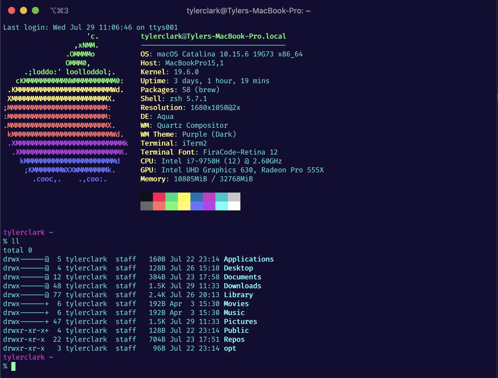
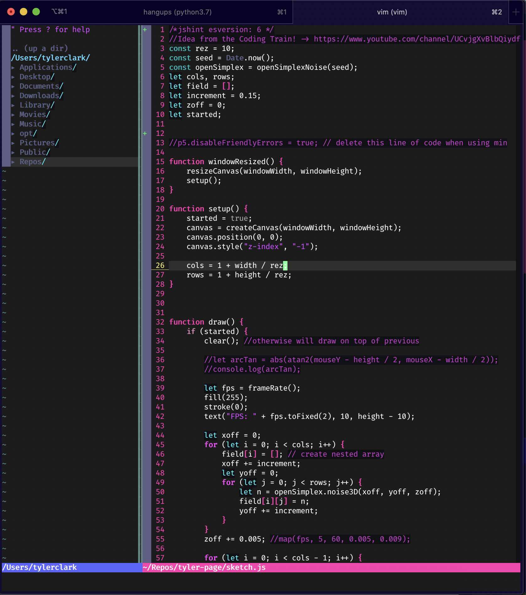

# my dotfiles

hello, curious one! these are my personal dotfiles. i am just starting to track my dotfiles so these will not be pretty. i will be constantly changing these.. as one does. 
my current efforts are:

* improving file structure
* improving vim usability (am vim noob)
* increasing portability

that being said.. feel free to try these out if you want. i want my dotfiles to be plug and play eventually, but i am still working on shell scripting. should work on *nix (minus the iterm2)

## some screens

these pics may or may not represent my setup, depending on how much changes i have made since upload. - 29 july '20

### zsh

### vim

## Installation

i use [GNU Stow](https://www.gnu.org/software/stow/manual/stow.html) to create symlinks between the /.dotfile directory and the necessary file locations. so the installation **should** work like this if i didn't miss some files to stow (probably did at this point):

1. clone this repo
2. cd into it
3. use command: " stow -nvSt ~ * " to ensure all files will correctly be linked
4. if no problems -> use command: " stow -vSt ~ * "

if problems -> panic
